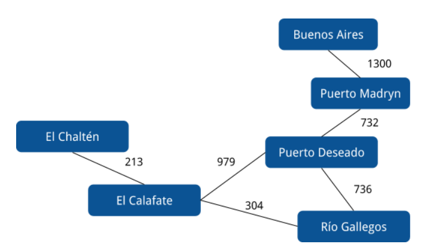

# Rutas

[](https://travis-ci.org/pdep-utn/eg-rutas-prolog)

Ejercicio de Rutas que permite encontrar la distancia en kilómetros entre dos ciudades pasando por diferentes rutas.



## Mecanismo de tabling

En este branch hacemos que el motor trabaje con el concepto de [**tabling**](https://www.swi-prolog.org/pldoc/man?section=tabling) -disponible desde la versión 8 de SWI-Prolog- y que pueden ver en [este ejemplo](https://www.swi-prolog.org/pldoc/man?section=tabling-non-termination). De esa manera el motor de inferencia Prolog hace optimizaciones generando una cache de resultados para las consultas, algo que es bastante común en las herramientas de hoy en día y que se conoce como [**memoization**](https://en.wikipedia.org/wiki/Memoization) (recordar por dónde pasé y qué individuos satisfacen cada consulta).

Esto permite que incluso un predicado tan _naif_ como

```prolog
kilometrosViaje(Destino, Origen, Kms):-
    kilometrosViaje(Origen, Destino, Kms).
```

no ocasione problemas cuando yo quiero hacer consultas como

```prolog
?- kilometrosViaje(calafate, buenosAires, Kilometros).
Kilometros = 3498 ;
Kilometros = 3437 ;
Kilometros = 3011 ;
Kilometros = 3072.
```

Incluso este mecanismo permite encontrar nuevas rutas, como vemos en los tests:

```prolog
test(distancias_posibles_usando_diferentes_rutas, set(Kilometros = [1711, 1772, 2137, 2198])):-
    kilometrosViaje(puertoMadryn, calafate, Kilometros).
```

Produce 4 soluciones para ir a Puerto Madryn:

- pasar por Puerto Deseado directo
- pasar por Puerto Deseado y Río Gallegos
- pasar por Puerto Deseado, llegar a Calafate, pasarse siguiendo a Chaltén y volver a Calafate (le agrega 426 kilómetros, los 213 de ida y otros 213 de vuelta Calafate-Chaltén)
- pasar por Puerto Deseado, luego Río Gallegos, llegar a Calafate pero seguir a Chaltén y volver a Calafate (le agrega nuevamente 426 kilómetros)
